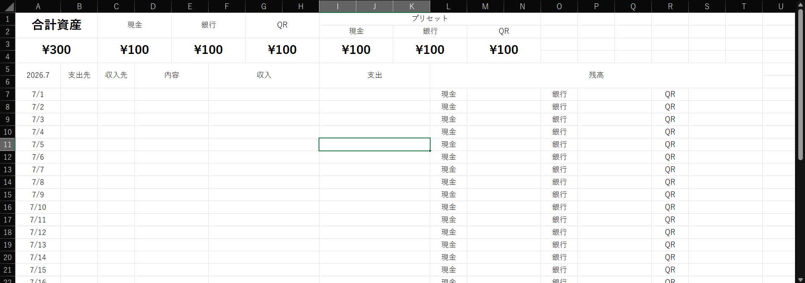

# Excel Asset Management


An asset management tool built with Microsoft Excel and VBA.

ExcelとVBAで開発された資産管理ツールです。

---

## 📸 Screenshot

> 

<!--
画像を追加したら次のように変更してください。


-->

---

## 🇯🇵 日本語

### 概要

Excel上で資産情報を管理するためのアプリケーションです。
VBAを活用し、資産情報の入力・検索・編集などを効率化します。

### 主な機能

- 資産情報の登録
- 資産情報の編集
- 資産情報の検索
- VBAによる自動処理
- Excelベースのシンプルな管理画面

### 動作環境

- Microsoft Excel
- Windows
- VBA (Visual Basic for Applications)

### 注意事項

- 本アプリケーションの表示言語は**日本語**です。
- 通貨表示は**日本円（JPY / ¥）**を前提としています。
- 日本国内での利用を想定して設計されています。
- Excelでマクロを有効にしてご利用ください。

### 使用方法

1. リポジトリをダウンロードまたはクローンします。
2. `Excel-Asset-Management.xlsx` を開きます。
3. マクロを有効化します。
4. 資産管理を開始します。

---

## 🇺🇸 English

### Overview

Excel Asset Management is an asset management application built with Microsoft Excel and VBA.

### Features

- Register asset information
- Edit asset information
- Search asset information
- VBA automation
- Simple Excel-based interface

### Requirements

- Microsoft Excel
- Windows
- VBA (Visual Basic for Applications)

### Notes

- The workbook interface is available **only in Japanese**.
- Currency formatting is configured for **Japanese Yen (JPY / ¥)**.
- This project is primarily designed for users in Japan.
- Please enable Excel macros before using the application.

### Getting Started

1. Clone or download this repository.
2. Open `Excel-Asset-Management.xlsx`.
3. Enable Excel macros.
4. Start managing your assets.

---

## 📁 Repository Structure

```text
.
├── Excel-Asset-Management.xlsx
├── .gitignore
├── LICENSE
└── README.md
```

---

## 🗺️ Roadmap

Planned improvements include:

- Data import/export
- Backup & restore
- Improved search functionality
- Additional VBA automation
- Better user interface
- Charts and reports

---

## 🤝 Contributing

Issues and suggestions are welcome.

If you find a bug or have an idea for improvement, please open an Issue.

---

## 📄 License

This project is licensed under the MIT License.

See the [LICENSE](LICENSE) file for details.
